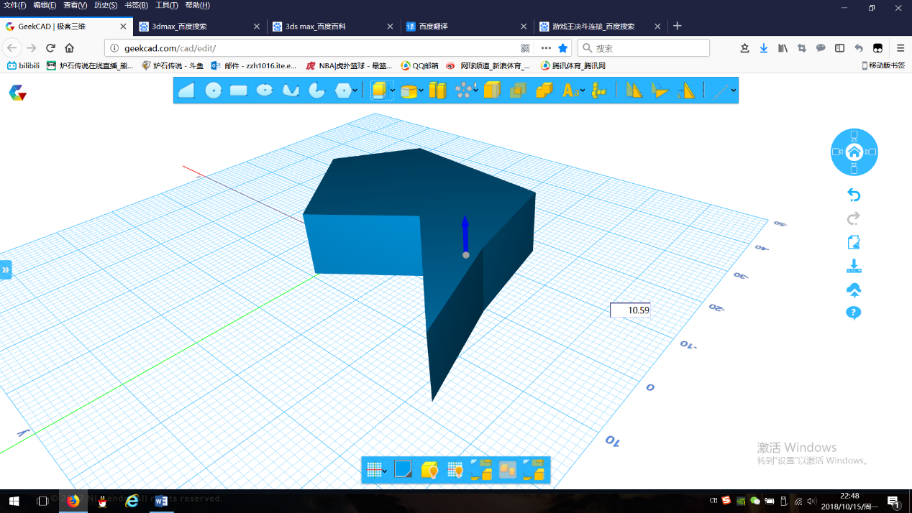

# 典型Web教育应用分析
### 朱子恒 10164507136
摘要：GeekCAD是一款能够实现网页中3D建模的web应用，主要应用于3D打印建模的教学之中，体现了人本主义学习理论和协作学习理论；慕课网是一个提供多种编程语言学习课程的网站，学生可以自由参与课程的学习，体现了行为主义学习理论。

## 网站简介
- GeekCAD

GeekCAD（[http://geekcad.com](http://geekcad.com)）是一款能够实现网页中3D建模的Web应用.在功能上，GeekCAD与很多基础的3D建模软件大同小异，例如123D Design等软件。都是在一个能够自由改变视角的参考面上进行建模，可以通过APP上方的几个按钮选择自己想要的图形作为底面，然后对图形进行拉神、椎体、扫掠、旋转、转体、复制、布尔运算等功能，来制作出想要的模型。

和其他3D建模软件相比，GeekCAD作为一款Web App，有着一个非常明显的优势：在GeekCAD中可以将已经做好的模型直接上传到云端，以便下次直接打开，同时也支持将模型共享给其他人，同时模型的创建者也可以让其他用户对这一个模型进行修改，非常好的实现了小组合作。同时也避免了小组协作过程中往往出现的版本、插件不一致的问题。

- 慕课网

慕课网（[https://www.imooc.com/](https://www.imooc.com/)）是一个提供多种编程语言学习课程的网站，例如HTML、java、Python、C++乃至更加复杂的内容。它根据不同的课程内容将不同的课程分类，用户可以根据自己的需求选择x相对应的板块，并选择对应的课程进行学习。

在学习的过程中，学生选择每个章节的内容进行学习，同时可以在问答区向老师提出问题，学生同样也可以参与回答，同时可以写下笔记并共享给和自己一起学习的同学,实现协作学习。在每一个知识点的位置，学生可以观看文本、图片、视频，最重要的是可以在模拟的环境中尝试编写一小段代码，来更深入的体会学习的过程。

## 网站学习理论分析

首先从GeekCAD说起。GeekCAD的功能是3D建模，相比于其他的教育应用，更类似于一种教学用的工具，它以学生为中心，学生可以利用这个工具自由地进行发挥，激发学生的创造力的想象力，让学生成为了学习的主导者,激发了学生的学习兴趣，这体现了人本主义学习理论。其次，GeekCAD的拥有小组协作的功能，学生可以通过共同创建模型，相互交流的过程中实现协作学习，提高学习效率，这体现了协作学习理论。

慕课网是一个在线学习平台，尽管学生可以自由地学习课程，也可以在模拟环境中自由编写一小段代码，但是就实际的使用中可以发现,学生的学习还是依赖于老师的引导，代码的编写也是设定在了老师提前预设好的框架之中，所以总体上还是以教师为主体进行教学，学生以按部就班接受l老师传授的知识的方式进行学习，所以这还是体现了行为主义学习理论。

## 一些建议

虽然这两个Web教育应用都有各自的特点，也有非常多吸引人将它们用于学习的优点，但依然有一些地方可以做得更好。

GeekCAD作为一个工具，从它应用的学习理论角度来看，已经是做的比较不错了，尤其是协作方面在同类产品中是一个亮点。但是，界面上,多种功能按钮的位置摆放比较凌乱，对于学生，尤其是初学者而言很难找到自己想要的功能，这在一定程度上会打击学生的积极性，降低学生的学习兴趣，可以将不同的功能做更好的分类并调整位置。其次，在协作方面，虽然颇有亮点，但是在小组成员之间的沟通方面存在一定的不便，可以再模型制作的地方加入贴标签的功能，来展示自己的创意，并帮助成员之间的沟通。

慕课网有着非常丰富的资源来吸引学生去学习，模拟环境也非常能够吸引学生并帮助学生学习，但是存在的问题在于在整个教学的过程中是以教师为中心，这样就无法把模拟环境这一个特色最大化的发挥出来。可以再课程的设计中，增加学生和教师互动的环节，同时，设计一些有创意问题，允许学生在模拟环境中自由发挥，这样更能让学生以自身为主体来进行学习，进一步激发学生的学习兴趣。